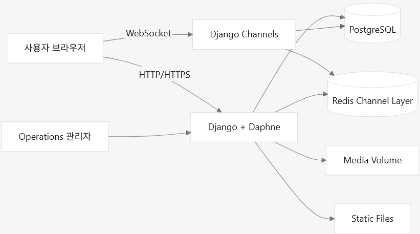
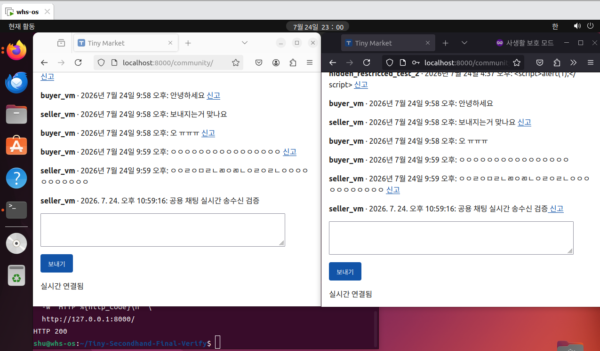
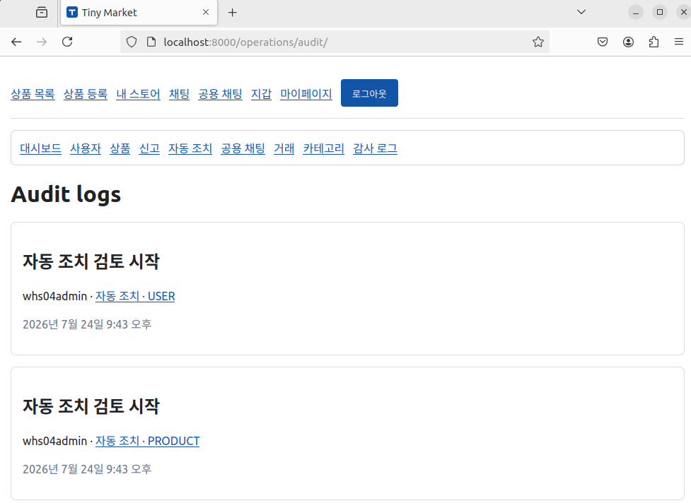
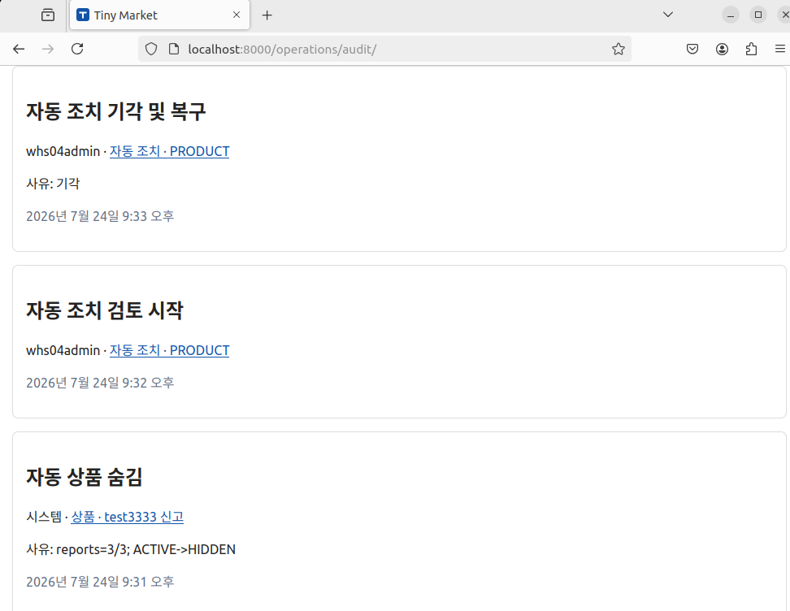
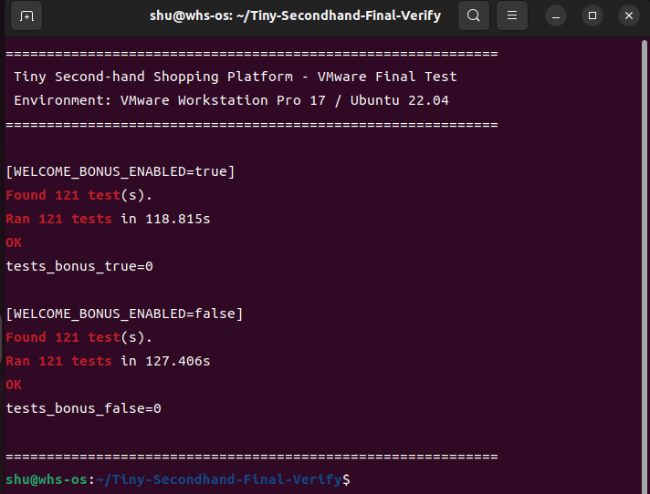
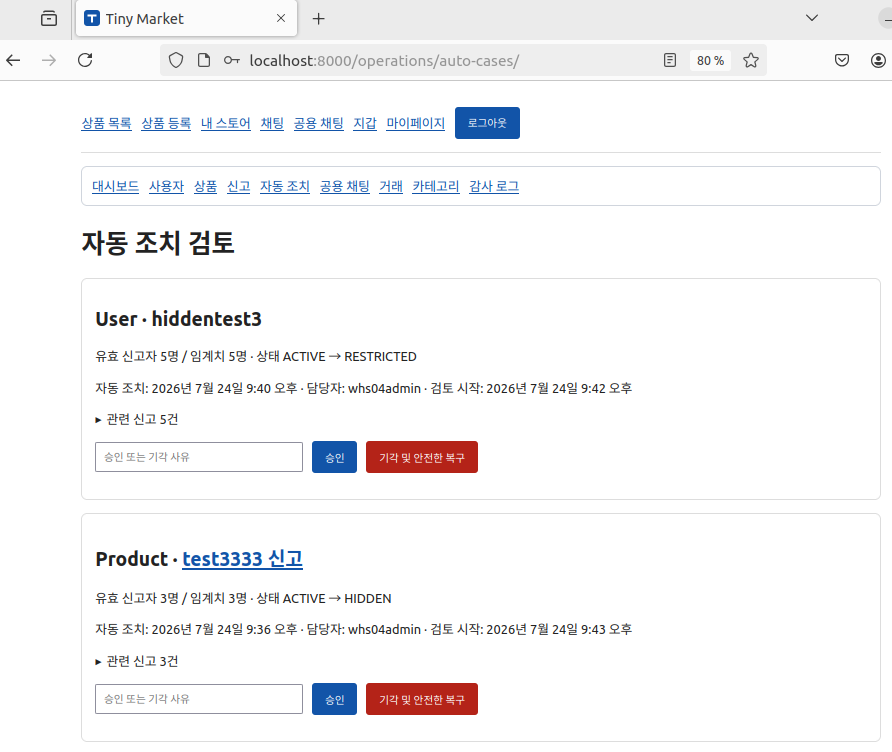
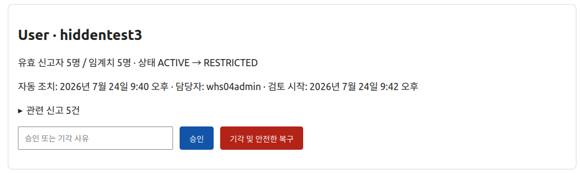
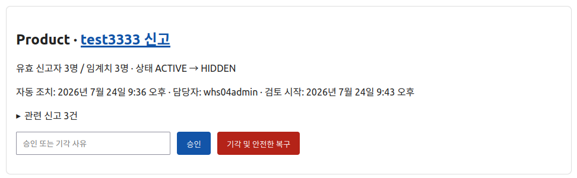

# Tiny Second-hand Shopping Platform 개발 및 보안 개선 보고서

## 문서 정보

| 항목 | 내용 |
|---|---|
| 프로젝트명 | Tiny Second-hand Shopping Platform |
| GitHub 저장소 | [shshuu/Tiny_Second-hand_Shopping_Platform](https://github.com/shshuu/Tiny_Second-hand_Shopping_Platform) |
| GitHub 저장소 | https://github.com/shshuu/Tiny_Second-hand_Shopping_Platform |
| 최종 main 커밋 | `01d81b8` |
| 최종 검증 환경 | VMware Workstation Pro 17, Ubuntu 22.04 Desktop |
| 주요 기술 | Django 5.2, PostgreSQL 16, Redis 7, Django Channels, Daphne, Docker Compose |
| 작성자 | @shshuu |
| 작성일 | 2026년 7월 24일 |

---

## 목차

1. [프로젝트 개요](#프로젝트-개요)
2. [개발 및 검증 역할](#개발-및-검증-역할)
3. [플랫폼 개발 전 과정](#플랫폼-개발-전-과정)
   - [요구사항 분석](#요구사항-분석)
   - [시스템 설계](#시스템-설계)
   - [구현](#구현)
   - [체크리스트 작성 및 테스팅](#체크리스트-작성-및-테스팅)
   - [유지보수](#유지보수)
4. [개발 과정에서 발견한 보안 약점](#개발-과정에서-발견한-보안-약점)
5. [최종 결과](#최종-결과)

---

# 프로젝트 개요

본 프로젝트는 사용자 간 중고 상품 등록, 검색, 채팅, 구매 및 신고 기능을 제공하는 소규모 중고 거래 플랫폼을 구현하는 것을 목적으로 한다.

단순히 기능을 구현하는 것에 그치지 않고, 중고 거래 서비스에서 발생할 수 있는 권한 우회, 중복 구매, 포인트 무결성 훼손, 악성 메시지 전송, 신고 기능 악용 및 관리자 기능 오용 등의 문제를 고려하여 보안 중심으로 설계하였다.

플랫폼은 실제 현금 결제가 아닌 내부 포인트를 이용하며, 다음과 같은 기능을 포함한다.

- 회원가입, 로그인 및 프로필 관리
- 상품 등록, 수정, 삭제, 검색 및 상태 관리
- 내부 포인트 기반 상품 구매
- 상품 기반 1:1 실시간 채팅
- 전체 사용자가 참여하는 전체 채팅
- 사용자·상품·채팅 메시지 신고
- 신고 누적에 따른 상품·사용자 자동 조치
- 운영자의 신고 및 자동 조치 검토
- 거래 원장과 감사 로그 보존
- Docker Compose를 이용한 재현 가능한 실행 환경

---

# 개발 및 검증 역할

본 프로젝트에서는 설계, 구현, 교차 검증 및 최종 수용시험의 역할을 구분하여 개발을 진행하였다.

| 역할 | 수행 내용 |
|---|---|
| 설계자 ChatGPT | 요구사항 분석, 시스템 구조 설계, 보안 정책 정의, 테스트 체크리스트 작성, 오류 원인 분석 및 수정 방향 제시 |
| 개발 담당 Codex | Django 애플리케이션 구현, Docker 환경 구성, 기능 수정, 마이그레이션 및 자동 테스트 작성 |
| 별도 검증 담당 Codex | 별도 환경에서 fresh clone 재현성, PostgreSQL·Redis 연동, 마이그레이션 및 전체 테스트 교차 검증 |
| 필자 | 최종 요구사항 결정, Git 브랜치 관리, VMware Ubuntu 환경 구축, 실제 브라우저 수동 검증, 오류 재현 및 최종 수용 여부 판단 |

AI 도구는 설계와 구현을 보조하는 방식으로 사용하였다. 최종 요구사항 결정, 실제 실행 환경 구성, 브라우저 수용시험, 오류 재현, 수정 결과 판단 및 제출본 관리는 필자가 직접 수행하였다.

---

# 플랫폼 개발 전 과정

## 요구사항 분석

### 1. 기능 요구사항

#### 1.1 회원 및 프로필

- 회원가입 및 로그인
- 사용자 프로필 조회와 수정
- 마이페이지 제공
- 사용자별 공개 식별자 사용
- 일반 사용자와 운영 관리자 역할 구분
- 사용자 상태에 따른 기능 제한

#### 1.2 상품

- 상품 등록, 수정, 삭제 및 조회
- 상품 이미지 업로드
- 상품 카테고리 관리
- 상품명, 설명 및 카테고리 기반 검색
- 상품 상태별 공개 범위와 행위 제한
- 관리자용 비공개 상품 조회 기능

상품 상태는 다음과 같이 정의하였다.

| 상태 | 의미 |
|---|---|
| `ACTIVE` | 일반 사용자에게 공개되고 구매할 수 있는 상품 |
| `DRAFT` | 판매자가 작성 중인 비공개 상품 |
| `RESERVED` | 거래가 예약된 상품 |
| `SOLD` | 판매가 완료된 상품 |
| `HIDDEN` | 신고 또는 운영 조치로 숨겨진 상품 |
| `DELETED` | 삭제된 상품 |

#### 1.3 구매 및 포인트

- 신규 사용자의 기본 포인트는 0으로 설정
- 환경 설정에 따라 가입 환영 포인트 지급
- 구매자의 포인트를 차감하고 판매자에게 지급
- 상품 구매와 포인트 이동을 하나의 트랜잭션으로 처리
- 구매 내역, 포인트 거래 내역 및 원장 기록
- 동일 상품 중복 구매 방지
- 사용자 간 임의 포인트 송금 기능 제외

본 프로젝트의 포인트는 서비스 내부에서만 사용하는 비현금성 값이다. 실제 결제, 충전, 출금, 환전 및 현금 환불 기능은 구현 범위에서 제외하였다.

#### 1.4 실시간 채팅

- 상품을 기준으로 한 구매자·판매자 간 1:1 채팅
- 전체 사용자가 참여하는 전체 커뮤니티 채팅
- WebSocket 기반 실시간 메시지 송수신
- 메시지 데이터베이스 저장
- 1:1 채팅의 읽지 않은 메시지 수 제공
- 전체 메시지는 1:1 채팅 unread 수에서 제외
- 사용자 상태별 채팅 권한 적용

#### 1.5 신고 및 자동 조치

다음 대상을 신고할 수 있도록 요구사항을 정의하였다.

- 사용자
- 상품
- 1:1 채팅 메시지
- 전체 채팅 메시지

신고 누적에 따른 기본 자동 조치 기준은 다음과 같다.

| 대상 | 임계치 | 자동 조치 |
|---|---:|---|
| 상품 | 서로 다른 유효 신고자 3명 | 상품을 `HIDDEN`으로 변경 |
| 사용자 | 서로 다른 유효 신고자 5명 | 사용자를 `RESTRICTED`로 변경 |

자동 조치가 이루어진 후에는 운영자가 해당 조치를 검토하고 승인하거나 기각할 수 있어야 한다.

#### 1.6 운영자 기능

- 사용자 관리
- 상품 관리
- 신고 관리
- 자동 조치 사건 관리
- 전체 채팅 메시지 관리
- 카테고리 관리
- 거래 및 포인트 이력 확인
- 감사 로그 확인

---

### 2. 보안 요구사항

기능 요구사항과 함께 다음 보안 요구사항을 정의하였다.

- 중요 권한 검사는 화면이 아닌 서버에서 수행
- 직접 URL 및 직접 POST 요청을 통한 권한 우회 방지
- 제한 사용자와 정지 사용자의 쓰기 행위 차단
- 비공개·숨김·삭제 상품의 직접 조회 및 구매 차단
- 구매와 포인트 이동의 원자성 보장
- 지갑 원장과 감사 로그의 임의 변경 방지
- 중복 신고와 자기 자신 대상 신고 방지
- 서로 다른 유효 신고자만 자동 제재에 포함
- 채팅 메시지를 통한 XSS 방지
- Content Security Policy 적용
- WebSocket 연결 시 인증 및 사용자 상태 확인
- Redis 장애 시 보안 검사가 우회되지 않도록 fail-closed 처리
- 일반 사용자의 Operations 접근 차단
- 실제 비밀키와 `.env` 파일의 Git 저장소 업로드 방지
- 데이터베이스와 업로드 파일의 Docker volume 보존
- 일부 감사 로그 데이터 오류로 전체 운영 화면이 중단되지 않도록 처리

---

### 3. 비기능 요구사항

- `git clone` 후 Docker Compose로 실행 가능해야 함
- PostgreSQL과 Redis를 실제 구성요소로 사용해야 함
- 재시작 및 컨테이너 재생성 후에도 데이터와 이미지가 유지되어야 함
- 데이터베이스 마이그레이션의 적용 가능성을 확인해야 함
- 자동 테스트와 수동 브라우저 테스트를 모두 수행해야 함
- 로컬 시연 설정과 운영 환경 설정을 분리해야 함
- 오류 발생 시 기존 데이터가 손상되지 않아야 함

---

## 시스템 설계

### 1. 전체 시스템 구성



### 2. 시스템 구성요소

| 구성요소 | 역할 |
|---|---|
| Django | 회원, 상품, 구매, 신고 및 운영자 기능 처리 |
| Daphne | Django ASGI 애플리케이션 실행 |
| Django Channels | 1:1 및 전체 채팅 WebSocket 처리 |
| PostgreSQL | 사용자, 상품, 거래, 신고, 메시지 및 감사 로그 저장 |
| Redis | Channel Layer와 rate-limit 백엔드 |
| Docker Compose | Web, PostgreSQL, Redis 실행 환경 구성 |
| Named Volume | PostgreSQL 데이터와 업로드 이미지 보존 |

### 3. 사용자 역할과 상태

사용자의 역할과 서비스 이용 상태를 분리하여 설계하였다.

#### 역할

| 역할 | 권한 |
|---|---|
| `USER` | 상품 등록, 구매, 채팅 및 신고 |
| `ADMIN` | Operations를 통한 사용자·상품·신고 관리 |
| `SUPERADMIN` | 관리자 역할 변경 등 상위 운영 권한 |

애플리케이션의 관리자 역할은 Django 내부의 `is_staff`, `is_superuser`와 분리하여 관리하였다.

#### 사용자 상태

| 상태 | 허용되는 주요 기능 |
|---|---|
| `ACTIVE` | 상품 등록·수정, 구매, 채팅, 신고 |
| `RESTRICTED` | 로그인과 조회 가능, 구매·상품 등록·편집·채팅·신고 제한 |
| `SUSPENDED` | 서비스의 주요 기능 접근 차단 |

`RESTRICTED` 사용자는 로그인, 프로필 수정, 공개 상품 조회 및 기존 채팅 내역 조회는 가능하지만, 상품 구매, 등록, 편집, 채팅 전송 및 신규 신고는 할 수 없도록 설계하였다.

### 4. 구매 및 포인트 처리 구조

구매는 다음 순서로 처리되도록 설계하였다.

```text
구매자 상태 확인
→ 상품 구매 가능 상태 확인
→ 구매자와 판매자 동일 여부 확인
→ 구매자 잔액 확인
→ 상품 및 구매 데이터 잠금
→ 중복 구매 여부 확인
→ 구매자 포인트 차감
→ 판매자 포인트 증가
→ 구매 내역 생성
→ 포인트 거래 원장 생성
→ 상품 상태 SOLD 변경
→ 트랜잭션 커밋
```

처리 중 하나라도 실패하면 전체 작업을 롤백하여 일부 데이터만 변경되는 것을 방지하였다.

### 5. 신고 및 자동 조치 구조

개별 신고와 신고 누적으로 생성되는 자동 조치 사건을 분리하였다.

- `Report`: 사용자가 제출한 개별 신고 한 건
- `AutoModerationCase`: 신고 임계치 도달 시 생성되는 관리자 검토 사건

자동 조치 흐름은 다음과 같다.

```text
서로 다른 유효 신고자 수 확인
→ 임계치 도달
→ 상품 HIDDEN 또는 사용자 RESTRICTED
→ AutoModerationCase 생성
→ 관리자 검토 시작
→ 승인 또는 기각
```

관리자가 자동 조치를 기각하면 안전한 조건에서 대상의 원래 상태를 복구한다. 완료된 사건은 수정할 수 없는 이력으로 유지하며, 이후 새로운 신고 주기가 임계치에 도달하면 별도의 사건을 생성한다.

### 6. 채팅 구조

#### 1:1 채팅

- 상품을 기준으로 구매자와 판매자가 대화
- 메시지를 데이터베이스에 저장
- 읽지 않은 메시지 수 계산
- 현재 보고 있는 채팅방의 메시지는 읽음 처리
- 다른 채팅방에서 발생한 메시지만 unread 증가

#### 전체 채팅

- 허용된 사용자가 하나의 전체 채팅방 사용
- 최근 메시지 50건 제공
- `ACTIVE` 사용자는 메시지 전송 가능
- `RESTRICTED` 사용자는 읽기 전용
- `SUSPENDED` 사용자는 접근 차단
- 전체 메시지는 1:1 unread 수에 포함하지 않음

---

## 구현

### 1. 회원 및 사용자 상태 기능

Django 인증 기능을 기반으로 회원가입, 로그인, 프로필 수정 및 마이페이지를 구현하였다.

각 사용자에게 UUID 형식의 공개 식별자를 부여하여 URL과 운영 화면에서 데이터베이스의 내부 기본 키가 직접 노출되는 것을 줄였다.

사용자의 역할과 상태를 별도로 저장하고, 상품 등록, 상품 편집, 구매, 채팅 및 신고 요청에서 서버가 권한을 검사하도록 구현하였다.

### 2. 상품 기능

상품 등록 시 다음 정보를 저장한다.

- 판매자
- 상품명
- 설명
- 가격
- 카테고리
- 이미지
- 상품 상태

상품 목록과 검색 결과에는 공개 가능한 상태의 상품만 표시하였다. `DRAFT`, `HIDDEN`, `DELETED` 상품은 일반 사용자에게 노출하지 않으며, URL을 직접 입력하더라도 접근할 수 없도록 처리하였다.

운영자는 Operations 상품 상세 화면에서 다음 정보를 확인할 수 있다.

- 상품 기본 정보
- 판매자
- 상태
- 가격
- 설명
- 이미지
- 관련 신고
- 자동 조치 사건
- 공개 식별자

카테고리는 운영자가 생성, 수정 및 비활성화할 수 있다. 비활성 카테고리는 신규 상품 등록 선택지에서 제외하지만 기존 상품의 카테고리 정보는 유지한다.

### 3. 검색 기능

다음 필드를 대상으로 상품을 검색하도록 구현하였다.

- 상품명
- 상품 설명
- 카테고리명

한글과 특수문자 검색을 지원하며, 검색 결과에서도 비공개 상태의 상품은 제외한다. 검색어는 HTML로 실행되지 않고 일반 문자열로 처리한다.

### 4. 구매 및 포인트 기능

구매자의 포인트를 차감하고 판매자의 포인트를 증가시키는 과정을 데이터베이스 트랜잭션으로 처리하였다.

구매 시 다음 조건을 검증한다.

- 구매자가 `ACTIVE` 상태인가
- 구매자와 판매자가 동일하지 않은가
- 상품이 구매 가능한 상태인가
- 구매자의 잔액이 충분한가
- 기존 구매가 존재하지 않는가
- 동일 요청이 중복 처리되지 않았는가

구매가 성공하면 다음 데이터가 함께 기록된다.

- 구매 내역
- 구매자 포인트 차감 내역
- 판매자 포인트 증가 내역
- 포인트 원장
- 상품의 `SOLD` 상태

### 5. 실시간 채팅

Django Channels와 Redis를 사용하여 1:1 채팅과 전체 채팅을 구현하였다.

WebSocket 메시지에는 다음 정보를 포함하였다.

- 메시지 공개 식별자
- 작성자 식별자
- 작성자 표시명
- 메시지 내용
- 작성 시각

실시간으로 메시지를 DOM에 추가할 때 사용자 입력을 `innerHTML`로 삽입하지 않고 `textContent`를 사용하였다.

WebSocket 연결이 일시적으로 중단되어도 전체 채팅의 작성 내용은 유지된다. 연결 중에도 사용자는 입력할 수 있지만 보내기 버튼만 비활성화되며, 연결 복구 후 사용자가 직접 전송하도록 구현하였다.



> **그림 2. 전체 채팅 실시간 송수신 검증**  
> 서로 다른 두 사용자로 전체 채팅에 접속한 후 한 사용자가 전송한 메시지가 상대방 화면에 새로고침 없이 표시되는 것을 확인하였다. 수신 메시지에는 작성자, 작성 시각 및 신고 링크가 함께 표시된다.

### 6. 신고 및 자동 조치

다음 대상을 신고할 수 있도록 구현하였다.

- 사용자
- 상품
- 1:1 채팅 메시지
- 전체 채팅 메시지

자동 조치 계산에는 다음 신고만 포함하였다.

- 서로 다른 신고자가 제출한 신고
- `ACTIVE` 상태의 신고자가 제출한 신고
- 자기 자신 또는 자기 콘텐츠를 대상으로 하지 않은 신고
- 기각되지 않은 신고

사용자 자동 제한에서는 다음 신고를 대상 사용자에게 귀속하여 합산하였다.

- 사용자 직접 신고
- 대상 사용자가 소유한 상품 신고
- 대상 사용자가 작성한 1:1 메시지 신고
- 대상 사용자가 작성한 전체 메시지 신고

동일 신고자가 여러 콘텐츠를 신고하더라도 사용자 임계치에서는 한 명으로 계산한다.

### 7. Operations 기능

Operations 화면에서 다음 항목을 관리하도록 구현하였다.

- 사용자
- 상품
- 신고
- 자동 조치 사건
- 전체 채팅 메시지
- 카테고리
- 거래
- 감사 로그



> **그림 7. 운영자 조치 감사 로그 기록 확인**  
> 신고 승인, 콘텐츠 숨김 및 자동 조치 처리 내역에 대해 수행자, 대상, 행위 및 처리 시각이 감사 로그에 기록되는 것을 확인하였다.

일반 신고와 자동 조치 사건은 다음 단계로 처리한다.

```text
PENDING
→ 검토 시작
→ REVIEWING
→ 승인 또는 기각
→ 완료 상태에서 read-only
```

검토 시작에는 처리 사유를 요구하지 않지만, 승인과 기각에는 사유 입력을 필수로 요구하였다.

전체 채팅 메시지 신고가 승인되면 해당 메시지를 즉시 숨기고 감사 로그를 생성한다.

### 8. 마이그레이션

최종적으로 `0001`부터 `0010`까지의 마이그레이션을 적용하였다.

`0010_allow_moderation_case_history`에서는 동일 상품 또는 사용자에게 완료된 자동 조치 사건이 존재하더라도 이후 새로운 신고 주기에 별도의 사건을 생성할 수 있도록 기존 단일 사건 고유 제약을 제거하였다.

완료된 사건은 이력으로 유지하고, `PENDING` 또는 `REVIEWING` 상태의 활성 사건만 중복 생성되지 않도록 애플리케이션 계층에서 제한하였다.

---

## 체크리스트 작성 및 테스팅

### 1. 전체 검증 절차

검증은 다음과 같은 다단계 방식으로 수행하였다.

```text
개발 담당 Codex 자동 테스트
→ 별도 검증 Codex의 교차 검증
→ Git 브랜치 반영
→ VMware Ubuntu 환경 재빌드
→ 마이그레이션 및 자동 테스트
→ 필자의 브라우저 수동 검증
→ 오류 발견 및 재현
→ 최소 범위 수정
→ 회귀 테스트
→ 최종 수용시험
```

### 2. 개발 담당 Codex 자동 검증

개발 담당 Codex는 Windows Docker Desktop의 PostgreSQL·Redis 환경에서 다음 항목을 확인하였다.

- Django system check
- 추가 마이그레이션 필요 여부
- 미적용 마이그레이션 여부
- focused test
- 전체 테스트
- welcome bonus 활성·비활성 환경
- 별도 데이터베이스를 이용한 마이그레이션 검증

### 3. 별도 검증 담당 Codex

별도 검증 담당 Codex는 다음 항목을 교차 검증하였다.

- fresh clone 기준 실행 가능 여부
- Docker Compose 재현성
- PostgreSQL·Redis 실제 연결
- 마이그레이션 적용
- 기존 데이터 보존
- 보안 정책 테스트
- 전체 테스트의 실제 종료 코드
- 로컬 데모 설정과 운영 설정 분리

Codex의 검증은 Windows Docker Desktop 환경에서 수행되었으며, VMware Ubuntu 환경은 필자가 별도로 검증하였다.

### 4. VMware Ubuntu 자동 테스트

최종 검증 환경은 다음과 같다.

```text
VMware Workstation Pro 17
Ubuntu 22.04 Desktop
Docker Compose 1.29.2
PostgreSQL 16
Redis 7
Django 5.2
Daphne
```

최종 자동 테스트 결과는 다음과 같다.

| 검증 항목 | 결과 |
|---|---:|
| `python manage.py check` | 성공, 종료 코드 0 |
| `python manage.py makemigrations --check` | 성공, 종료 코드 0 |
| `python manage.py migrate --check` | 성공, 종료 코드 0 |
| `0010` 마이그레이션 | 적용 완료 |
| `WELCOME_BONUS_ENABLED=true` | 121/121 통과, 종료 코드 0 |
| `WELCOME_BONUS_ENABLED=false` | 121/121 통과, 종료 코드 0 |



> **그림 6. VMware Ubuntu 환경의 최종 자동 테스트 결과**  
> VMware Workstation Pro 17의 Ubuntu 22.04 Desktop 환경에서 Django 검사와 전체 테스트를 수행하였다. `WELCOME_BONUS_ENABLED=true` 및 `false` 환경에서 각각 121개의 테스트가 모두 통과하고 종료 코드 0을 반환하였다.

테스트 중 출력된 Redis 오류 traceback은 rate-limit 저장소 장애 상황을 의도적으로 발생시키는 테스트이다. 최종 결과가 `OK`이고 테스트 프로세스의 종료 코드가 0이므로 정상 통과로 판단하였다.

### 5. 브라우저 수동 검증

필자는 일반 브라우저와 시크릿 브라우저를 이용해 서로 다른 사용자로 로그인하고 실제 기능을 검증하였다.

#### 회원 및 상품

- 회원가입과 로그인
- 프로필 수정
- 상품 등록, 수정 및 삭제
- 이미지 업로드
- 컨테이너 재시작 후 이미지 보존
- 상품 상태별 노출 정책
- 비공개 상품 직접 URL 접근 제한
- 상품명·설명·카테고리 검색
- 비공개 상품 검색 결과 제외

#### 구매 및 포인트

- 정상 구매
- 구매자 포인트 차감
- 판매자 포인트 증가
- 상품의 `SOLD` 전환
- 중복 구매 방지
- 구매 및 원장 기록
- `RESTRICTED` 사용자 구매 차단
- 구매 차단 시 포인트·상품·거래 내역 무변경

#### 1:1 채팅

- 실시간 메시지 송수신
- 메시지 영속성
- unread 증가
- 채팅방 읽음 처리
- 다른 채팅방의 unread 유지
- unread가 0일 때 배지 전체 숨김
- 제한 사용자의 읽기 전용 처리

#### 전체 채팅

- WebSocket 101 연결
- 최초 메시지부터 실시간 수신
- 작성자와 작성 시각 표시
- 타인 메시지 신고 링크 표시
- 본인 메시지 신고 링크 미표시
- 전체 메시지의 1:1 unread 제외
- XSS 문자열 일반 텍스트 처리
- reconnect 중 입력 내용 유지
- 연결 상태에 따른 보내기 버튼 제어
- 메시지 중복 미발생

#### 신고와 자동 조치

- 신고자 1명과 2명에서는 상품 `ACTIVE` 유지
- 서로 다른 신고자 3명에서 상품 `HIDDEN`
- 자동 조치 기각 후 상품 `ACTIVE` 복구
- 기각된 신고가 다음 자동 조치에 재사용되지 않음
- 새로운 신고자 3명에서 두 번째 자동 조치 사건 생성
- 첫 번째 사건과 두 번째 사건의 독립 처리
- 서로 다른 신고자 5명에서 사용자 `RESTRICTED`
- 제한 사용자의 구매·상품 등록·상품 편집·채팅·신고 차단
- 사용자 자동 조치 사건에 관련 신고 5건 표시
- 자동 조치 기각 후 사용자 `ACTIVE` 복구
- 완료된 자동 조치 사건 read-only 처리



> **그림 3. 상품 / 채팅 신고 누적에 따른 자동 처리 검증**



> **그림 4. 상품 신고 누적에 따른 자동 숨김 검증**  
> 서로 다른 유효 신고자 3명의 신고가 누적되자 대상 상품이 자동으로 `HIDDEN` 처리되고, Operations의 자동 조치 탭에 상품 대상 사건과 관련 신고가 생성된 것을 확인하였다.



> **그림 5. 사용자 신고 누적에 따른 자동 제한 검증**  
> 대상 사용자와 해당 사용자의 콘텐츠에 대한 서로 다른 유효 신고자가 5명에 도달하자 사용자가 `RESTRICTED` 상태로 자동 전환되고, Operations의 자동 조치 탭에 관련 신고 5건이 표시되는 것을 확인하였다.

#### Operations

- 일반 사용자 접근 차단
- 카테고리 생성·수정·비활성화
- 비공개 상품 관리자 조회
- 일반 신고의 검토 시작·승인·기각
- 자동 조치 사건의 검토 시작·승인·기각
- 전체 메시지 신고 승인 시 자동 숨김
- 신고된 메시지 원문 확인
- 감사 로그 조회
- 처리자와 처리 사유 기록

### 6. 테스트 결과에 따른 수정

브라우저 검증 과정에서 다음 문제가 발견되었다.

- 전체 채팅 최초 메시지 실시간 수신 실패
- 실시간 메시지의 시각과 신고 링크 누락
- unread가 0인데 빈 빨간 배지가 남는 문제
- 감사 로그 화면 HTTP 500 오류
- 신고자 5명 이후에도 사용자가 제한되지 않는 문제
- 자동 조치 기각 후 과거 신고가 다시 사용되는 문제
- 두 번째 자동 조치 사건을 생성·처리할 수 없는 문제
- 제한 사용자의 구매 및 상품 편집 가능 문제
- WebSocket reconnect 중 입력창 전체 잠금 문제

각 문제는 다음 절차로 처리하였다.

```text
오류 재현
→ 원인 분석
→ 최소 범위 수정
→ 자동 테스트 추가 또는 보완
→ Docker 이미지 재빌드
→ VMware Ubuntu 재검증
```

---

## 유지보수

### 1. Git 브랜치 전략

개발과 검증은 `fix/fresh-clone-usability` 브랜치에서 수행하였다.

주요 최종 커밋은 다음과 같다.

| 커밋 | 내용 |
|---|---|
| `ffd2dbf` | 전체 채팅 및 자동 신고 조치 구현 |
| `99ba756` | 신고 검토 흐름과 실시간 채팅 UI 수정 |
| `05bc0cc` | 제한 사용자 권한과 자동 조치 사건 이력 수정 |
| `fd0f3df` | 전체 채팅 입력창 상태 수정 |
| `01d81b8` | 최종 검증 브랜치를 `main`에 병합 |

VMware 브라우저 수용시험 완료 후 기능 브랜치를 `main`에 병합하였다.

최종적으로 다음을 확인하였다.

```text
local main: 01d81b8
remote main: 01d81b8
working tree: clean
```

### 2. 데이터 백업 및 보존

PostgreSQL과 업로드 파일은 다음 named volume에 저장하였다.

```text
tinyfreshverify_postgres_data
tinyfreshverify_media_data
```

VM 종료 전에는 `pg_dump`를 이용해 데이터베이스 백업을 생성하였다.

컨테이너 재구성 시 데이터를 삭제할 수 있는 다음 명령은 사용하지 않았다.

```bash
docker-compose down -v
docker volume prune
docker system prune -a --volumes
```

컨테이너만 중지하거나 재생성하고 named volume을 유지하여 사용자, 상품, 메시지, 신고, 거래 및 이미지 데이터를 보존하였다.

### 3. 마이그레이션 유지보수

마이그레이션 적용 전 데이터베이스를 백업하고, 최종적으로 `0001`부터 `0010`까지 모두 적용된 것을 확인하였다.

```text
[X] 0001_initial
[X] 0002_wallet_immutability_triggers
[X] 0003_user_public_id_product_indexes
[X] 0004_audit_log_immutability
[X] 0005_report_assignment
[X] 0006_purchase_and_chat_read_state
[X] 0007_automoderationcase
[X] 0008_automoderationcase_assignment
[X] 0009_automoderationcase_reviewing
[X] 0010_allow_moderation_case_history
```

### 4. 장애 대응

VMware 또는 Docker가 비정상 종료된 경우 다음 절차를 사용하였다.

```text
PostgreSQL named volume 확인
→ PostgreSQL 단독 시작
→ pg_isready 확인
→ 데이터베이스 백업
→ docker-compose down --remove-orphans
→ docker-compose up -d --build
→ 마이그레이션 확인
→ Django 검사
→ 자동 테스트
```

Legacy Docker Compose 1.29.2에서 `ContainerConfig` 오류가 발생했을 때는 volume을 삭제하지 않고 문제가 있는 Web 컨테이너만 제거한 뒤 다시 생성하였다.

### 5. 향후 운영 환경 개선 사항

본 프로젝트는 로컬 및 과제 시연 환경을 기준으로 구현하였다. 실제 운영 환경에서는 다음 보호조치가 추가로 필요하다.

- TLS가 적용된 reverse proxy
- 방화벽과 네트워크 ACL
- Secret Manager와 같은 안전한 비밀정보 저장소
- 운영자 MFA
- 중앙 집중식 로그 및 SIEM 연동
- 주기적인 데이터베이스 백업
- 업로드 파일 악성코드 검사
- Media 디렉터리 실행 권한 제거
- WebSocket 및 HTTP 요청 모니터링
- 정기적인 의존성 및 컨테이너 이미지 취약점 점검
- 관리자 변경 작업 알림
- 비정상 거래 및 신고 행위 탐지

---

# 개발 과정에서 발견한 보안 약점

## 보안약점 1. 제한 사용자 서버 측 권한 검사 누락

**설명:**  
초기 구현에서는 `RESTRICTED` 사용자가 화면상 일부 기능을 사용할 수 없었지만, 구매 처리와 상품 편집 요청의 서버 측 상태 검사가 완전하지 않았다. 제한 사용자가 직접 URL이나 POST 요청을 구성하면 구매 또는 상품 정보 변경을 시도할 수 있었다.

**어떻게 수정했나:**  
구매 View와 구매 Service 양쪽에서 사용자 상태를 검사하도록 수정하였다. 상품 편집 View에서도 `RESTRICTED` 사용자의 직접 요청을 403으로 거부하였다. 구매 차단 시 포인트, 상품 상태 및 거래 이력이 변경되지 않는 것을 확인하였다.

---

## 보안약점 2. 화면 요소 숨김에 의존한 접근 통제

**설명:**  
버튼이나 링크를 화면에서 숨기는 것만으로는 보안 통제가 되지 않는다. 사용자는 URL을 직접 입력하거나 요청을 변조하여 숨겨진 기능을 호출할 수 있다.

**어떻게 수정했나:**  
상품 등록·편집, 구매, 채팅 전송, 신고 및 Operations 접근 시 View와 Service 계층에서 역할과 상태를 다시 검증하였다. 프런트엔드 표시 여부와 관계없이 서버에서 최종 권한을 판단하도록 수정하였다.

---

## 보안약점 3. 비공개 상품 직접 접근 가능성

**설명:**  
목록과 검색에서 숨겨진 `DRAFT`, `HIDDEN`, `DELETED` 상품이라도 URL을 알고 있으면 상세 페이지나 구매 요청에 접근할 가능성이 있었다.

**어떻게 수정했나:**  
상품 상태별 공개 정책을 서버 쿼리와 상세 View에 적용하였다. 일반 사용자는 비공개 상품을 직접 조회하거나 구매할 수 없게 하였으며, 운영자만 Operations 상품 상세에서 확인할 수 있도록 분리하였다.

---

## 보안약점 4. 구매 과정의 경쟁 상태와 중복 처리

**설명:**  
동일 상품에 여러 구매 요청이 동시에 발생하거나 동일 요청이 반복되면 상품이 중복 판매되거나 포인트가 여러 번 이동할 수 있다.

**어떻게 수정했나:**  
상품 구매와 포인트 이동을 하나의 데이터베이스 트랜잭션으로 처리하였다. 상품 상태와 기존 구매를 확인하고, 중복 요청 방지 정책을 적용하였다. 처리 중 오류가 발생하면 전체 작업을 롤백하도록 구성하였다.

---

## 보안약점 5. 포인트 및 원장 무결성 훼손 가능성

**설명:**  
지갑 잔액이나 거래 원장이 일반 수정 기능으로 변경되면 구매 기록과 실제 잔액이 일치하지 않을 수 있다.

**어떻게 수정했나:**  
포인트 이동 시 구매자·판매자 거래 내역과 원장을 함께 생성하였다. 지갑 이력과 감사 로그를 append-only 구조로 관리하고 PostgreSQL 트리거를 이용해 기존 기록의 수정과 삭제를 방지하였다.

---

## 보안약점 6. 임의 사용자 간 포인트 전송 악용 가능성

**설명:**  
사용자 간 자유로운 포인트 송금 기능을 제공하면 계정 탈취, 비정상 포인트 이동, 중복 요청 및 잔액 조작 위험이 증가한다.

**어떻게 수정했나:**  
포인트 이동은 상품 구매 트랜잭션을 통해서만 수행하도록 제한하였다. 임의 P2P 송금, 실제 충전, 출금 및 환전 기능은 구현 범위에서 제외하였다.

---

## 보안약점 7. 채팅 메시지를 통한 XSS

**설명:**  
사용자가 다음과 같은 문자열을 입력하고 해당 내용이 HTML로 렌더링되면 다른 사용자의 브라우저에서 스크립트가 실행될 수 있다.

```html
<script>alert(1);</script>
```

**어떻게 수정했나:**  
서버 템플릿에서 메시지를 escape하고, WebSocket 메시지를 DOM에 추가할 때 `innerHTML` 대신 `textContent`를 사용하였다. JavaScript를 외부 정적 파일로 분리하고 `script-src 'self'`를 포함한 Content Security Policy를 적용하였다. 실제 브라우저에서 XSS 문자열이 일반 텍스트로 표시되는 것을 확인하였다.

---

## 보안약점 8. WebSocket 연결 상태와 사용자 권한 혼합

**설명:**  
전체 채팅 입력 권한과 WebSocket 연결 상태를 하나의 조건으로 처리하여 `ACTIVE` 사용자의 입력창이 계속 비활성화되는 문제가 발생하였다. 잘못된 재연결 처리는 중복 연결이나 중복 메시지의 원인이 될 수도 있다.

**어떻게 수정했나:**  
`accountCanSend`와 `socketReady` 상태를 분리하였다. `ACTIVE` 사용자는 연결 상태와 관계없이 입력할 수 있지만 보내기 버튼은 WebSocket이 OPEN일 때만 활성화하였다. reconnect timer와 소켓 인스턴스를 각각 하나만 유지하도록 제한하였다.

---

## 보안약점 9. 신고 기능의 중복 및 악용 가능성

**설명:**  
한 사용자가 동일한 대상을 반복 신고하거나 자신의 계정 및 콘텐츠를 신고하면 소수 사용자가 자동 제재를 의도적으로 유발할 수 있다.

**어떻게 수정했나:**  
자동 조치 계산 시 서로 다른 유효 신고자만 집계하였다. 자기 자신과 자기 콘텐츠 신고를 제외하고 `ACTIVE` 신고자만 포함하였다. 제한·정지·비활성 신고자와 기각된 신고는 임계치 계산에서 제외하였다.

---

## 보안약점 10. 사용자 신고 집계 범위 누락

**설명:**  
초기에는 사용자를 직접 신고한 건만 사용자 자동 제한에 포함되어, 동일 사용자의 상품이나 메시지가 다수 신고되어도 사용자 계정이 제한되지 않았다.

**어떻게 수정했나:**  
대상 사용자를 기준으로 직접 사용자 신고, 소유 상품 신고, 작성한 1:1 메시지 신고 및 전체 메시지 신고를 합산하였다. 동일 신고자가 여러 콘텐츠를 신고하더라도 사용자 임계치에서는 한 명으로 집계하였다.

---

## 보안약점 11. 기각된 신고의 자동 조치 재사용

**설명:**  
상품 자동 조치를 기각하여 상품을 복구한 후 새로운 신고 한 건만 발생해도 과거 신고가 다시 계산되어 즉시 `HIDDEN` 상태가 되는 문제가 있었다.

**어떻게 수정했나:**  
자동 조치 사건을 기각할 때 해당 사건에 기여한 `PENDING` 또는 `REVIEWING` 신고를 `REJECTED`로 종료하였다. 이후 자동 조치는 새로운 신고 주기만을 기준으로 계산하도록 변경하였다.

---

## 보안약점 12. 완료된 자동 조치 사건 재사용

**설명:**  
초기 모델은 상품 또는 사용자별로 하나의 `AutoModerationCase`만 존재하도록 제한하였다. 첫 번째 사건 완료 후 새로운 신고 임계치에 도달해도 새 사건을 만들지 못하거나 기존 사건을 다시 사용하는 문제가 발생하였다.

**어떻게 수정했나:**  
`0010_allow_moderation_case_history` 마이그레이션을 추가해 단일 사건 고유 제약을 제거하였다. 완료된 사건은 read-only 이력으로 유지하고 새로운 신고 주기에는 별도의 사건을 생성하도록 수정하였다.

---

## 보안약점 13. 자동 조치 동시·중복 처리 가능성

**설명:**  
여러 관리자가 같은 자동 조치 사건을 동시에 처리하면 승인과 기각이 중복 실행되거나 오래된 화면의 요청이 최신 상태를 덮어쓸 수 있다.

**어떻게 수정했나:**  
사건 상태와 version을 이용한 낙관적 동시성 검사를 적용하였다. 완료된 사건에서는 입력과 처리 버튼을 제거하고 read-only로 표시하여 재처리를 방지하였다.

---

## 보안약점 14. 신고 승인과 실제 콘텐츠 조치 분리

**설명:**  
전체 채팅 메시지 신고를 승인해도 신고 상태만 변경되고 메시지는 계속 공개되는 문제가 있었다. 관리자가 신고 탭과 전체 채팅 관리 탭에서 별도로 조치해야 하므로 처리 누락 가능성이 있었다.

**어떻게 수정했나:**  
전체 메시지 신고 승인과 메시지 `HIDDEN` 처리를 동일한 작업으로 수행하였다. 승인 시 메시지를 숨기고 AuditLog를 함께 생성하도록 수정하였다.

---

## 보안약점 15. 불필요한 채팅 조회 기능

**설명:**  
신고 화면에 `조회 사유`와 `신고 연결 채팅 조회` 기능이 존재했지만 목적이 불명확했으며, 전체 채팅 신고에서 호출하면 잘못된 POST 오류가 발생하였다. 불필요한 운영 기능은 공격 표면과 운영 오류 가능성을 증가시킨다.

**어떻게 수정했나:**  
해당 입력란과 버튼을 신고 화면에서 제거하였다. 신고 카드에 신고 대상 사용자와 신고된 메시지 원문을 안전한 텍스트로 표시하여 별도 채팅 조회 기능 없이 관리자가 판단할 수 있도록 하였다.

---

## 보안약점 16. 감사 로그 대상 값에 의한 운영 화면 장애

**설명:**  
AuditLog의 자유 형식 대상 값이 UUID 형식이 아닌 경우 PostgreSQL UUID 조회에 직접 전달하면 변환 오류가 발생하여 감사 로그 전체 페이지가 HTTP 500으로 중단될 수 있었다.

**어떻게 수정했나:**  
UUID 형식이 유효한 값만 resolver 조회에 사용하였다. UUID가 아니거나 대상 객체가 삭제된 경우 예외를 발생시키지 않고 대상 종류와 식별자를 포함한 fallback 정보를 표시하도록 수정하였다.

---

## 보안약점 17. Rate-limit 저장소 장애 시 검사 우회

**설명:**  
Redis와 같은 rate-limit 백엔드가 중단됐을 때 요청을 그대로 허용하면 공격자가 저장소 장애 상황을 이용해 요청 제한을 우회할 수 있다.

**어떻게 수정했나:**  
중요한 포인트 이동 기능에서는 Redis 오류가 발생하면 요청을 허용하지 않는 fail-closed 정책을 적용하였다. 자동 테스트에서 Redis 예외를 의도적으로 발생시키고 요청이 안전하게 거부되는 것을 확인하였다.

---

## 보안약점 18. 환경 설정과 비밀정보 노출

**설명:**  
Django Secret Key, 데이터베이스 비밀번호 및 Debug 설정이 Git 저장소에 포함되면 세션 위조, 정보 노출 및 운영 환경 침해로 이어질 수 있다.

**어떻게 수정했나:**  
실제 `.env`는 Git 추적 대상에서 제외하고 `.env.example`만 제공하였다. `DJANGO_DEBUG=false`를 사용하고 로컬 시연 기능은 별도 설정값으로 분리하였다. 실제 비밀키를 README, Git 이력 및 제출 자료에 포함하지 않았다.

---

## 보안약점 19. 컨테이너 재생성 시 데이터 유실

**설명:**  
PostgreSQL 데이터와 업로드 파일이 컨테이너 내부에만 저장되면 컨테이너를 삭제하거나 재빌드할 때 사용자, 상품, 채팅, 신고 및 이미지 데이터가 손실될 수 있다.

**어떻게 수정했나:**  
PostgreSQL과 media 데이터를 named volume에 저장하였다. 재빌드 시 `down -v`를 사용하지 않았으며, VM 종료 전 `pg_dump` 백업과 volume 존재 여부를 확인하였다.

---

# 최종 결과

본 프로젝트에서는 중고 거래 플랫폼의 기본 기능뿐 아니라 상품 상태, 사용자 상태, 구매 원자성, 포인트 원장, 실시간 채팅, 신고 누적, 자동 조치, 운영자 검토 및 감사 로그를 포함한 보안 중심 구조를 구현하였다.

자동 테스트만으로 발견되지 않은 권한 및 사용자 인터페이스 상태 문제를 VMware Ubuntu 환경의 실제 브라우저 검증을 통해 발견하였다. 발견된 문제는 요구사항 재검토, 수정, 자동 회귀 테스트, Docker 이미지 재빌드 및 브라우저 재검증 과정을 반복하여 해결하였다.

최종 검증 결과는 다음과 같다.

```text
GitHub:
https://github.com/shshuu/Tiny_Second-hand_Shopping_Platform

최종 main commit:
01d81b8

Migration:
0001~0010 적용 완료

Django check:
통과, exit 0

makemigrations --check:
통과, exit 0

migrate --check:
통과, exit 0

WELCOME_BONUS_ENABLED=true:
121/121 테스트 통과, exit 0

WELCOME_BONUS_ENABLED=false:
121/121 테스트 통과, exit 0

VMware Workstation Pro 17 / Ubuntu 22.04:
최종 브라우저 수용시험 통과
```

