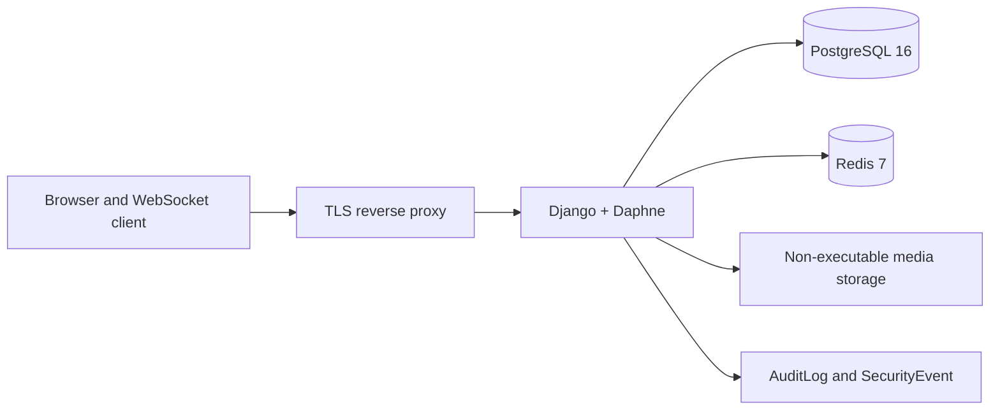

# Tiny Second-hand Platform — §28 final delivery

Status: §28-1 through §28-10 are verified complete; the application is functionally frozen.

## Completion table

| Stage | Scope | Final status |
|---|---|---|
| §28-1 | Docker, PostgreSQL, Redis, Django baseline | Verified complete |
| §28-2 | User, profile, authentication, block/state policy | Verified complete |
| §28-3 | Wallet, welcome grant, ledger, immutability | Verified complete |
| §28-4 | Products, states, safe image upload | Verified complete |
| §28-5 | Search, filters, sorting, pagination | Verified complete |
| §28-6 | HTTP/WebSocket chat and Redis Channels | Verified complete |
| §28-7 | Reports, automatic actions, audit history | Verified complete |
| §28-8 | Transfers, grants, reversal, limits | Verified complete |
| §28-9 | Role-based operations and audit controls | Verified complete |
| §28-10 | Deployment-boundary and response security | Verified complete |

## Architecture

Text equivalent: the browser reaches Django/Daphne through a TLS proxy in production. Django stores persistent data and immutable wallet records in PostgreSQL, uses Redis for rate limits and the Channels layer, serves uploaded media only through a non-executable production media boundary, and records security/operations events in application models.

## Docker services and network boundary

`docker-compose.yml` defines `web`, `db`, and `redis`. PostgreSQL and Redis have healthchecks; `web` waits for both to be healthy. The development mapping is `${WEB_PORT:-8000}:8000`: host port 8000 by default and configurable through `.env` `WEB_PORT`. Changing a Compose project name does not resolve a host-port collision. Production must expose only the TLS proxy; web, PostgreSQL, and Redis must stay on private networks.

## Core models and data flow

| Area | Models | Design |
|---|---|---|
| Identity | `User`, `Profile`, `Block` | Public UUIDs; server-side role/state/object checks |
| Marketplace | `Category`, `Product`, `ProductImage` | Ownership, soft deletion, controlled status transitions |
| Chat | `ChatRoom`, `ChatParticipant`, `ChatMessage` | Product-based DIRECT membership and append-style messages; historic GLOBAL data has no public flow |
| Reports | `Report` | Target UUID validation, duplicate constraint, assignment version |
| Wallet | `Wallet`, `WalletTransaction`, `LedgerEntry` | Balance is ledger-derived; append-only financial records |
| Operations | `AuditLog`, `SecurityEvent`, `Notification` | Important actions/events retained without secrets |

## Atomic registration, wallet, and transfer design

- `register_user()` runs user, profile, zero-balance wallet, and optional welcome grant in one atomic transaction.
- Initial balance is never client- or admin-form controlled.
- `grant_key` UNIQUE prevents concurrent duplicate welcome grants.
- Transfer locks both wallets in primary-key order, then rechecks balance and daily limits.
- PostgreSQL uniqueness provides final idempotency protection. Same request returns the existing result; conflicting content is rejected.
- In-app/external notification behavior is tied to transaction commit so rollback leaves no notification.

## Ledger immutability and PostgreSQL triggers

- Every point movement creates a transaction and ledger entry.
- DB constraints enforce one wallet per user, non-negative balance, positive values, and one reversal per original transaction.
- PostgreSQL triggers block UPDATE and DELETE on wallet transactions and ledger entries.
- Reversal creates a new opposite-direction transaction; it never edits the original.
- Ledger mismatch verification creates `LEDGER_MISMATCH`; it does not silently overwrite the wallet balance.

## WebSocket chat and Redis Channel Layer

ASGI uses `ProtocolTypeRouter`, `AuthMiddlewareStack`, and `URLRouter`. Redis is the Channel Layer. HTTP and WebSocket message creation share the same `send_message()` validation for membership, user state, blocking, message size, blank content, and rate limiting. Anonymous/nonparticipant connections are refused; blocked or restricted users cannot transmit.

## Reports, automatic action, and operations flow

Valid reports are deduplicated by reporter/target and counted by distinct valid reporters. Thresholds apply temporary product `HIDDEN` or user `RESTRICTED` status; they do not perform permanent deletion. Report transitions are controlled (`PENDING → REVIEWING → ACCEPTED/REJECTED → RESOLVED`) and audited. Assignment uses `assignment_version` optimistic concurrency.

## Operations roles

| Capability | USER | MODERATOR | ADMIN | SUPERADMIN |
|---|---:|---:|---:|---:|
| Operations access / report processing | No | Yes | Yes | Yes |
| Hide product/message | No | Yes | Yes | Yes |
| Restrict/suspend user | No | No | Yes | Yes |
| Grant points / reverse transfer | No | No | Yes | Yes |
| Change roles | No | No | No | Yes |
| Directly edit balance, transactions, ledgers, audit logs | No | No | No | No |

High-risk actions use public IDs, POST, CSRF, reason, object permission, and where required current-password reauthentication. Admin session policy: idle 900 seconds, absolute 28,800 seconds, reauthentication valid only when elapsed time is `< 300` seconds.

## Security policy

- Production requires explicit non-wildcard `ALLOWED_HOSTS`, HTTPS CSRF origins, non-development secret/database credential, PostgreSQL/Redis URLs, and trusted proxy configuration.
- HTTPS redirect, HSTS (31,536,000 seconds, includeSubDomains, preload), Secure/HttpOnly/SameSite cookies, nosniff, frame denial, referrer policy, permissions policy, and CSP are set.
- CSP permits only same-origin connections, including the application WebSocket origin; it excludes `unsafe-eval` and broad source wildcards.
- Django serves media URLs only in DEBUG mode. Production media is separate from static files and must be non-executable with `nosniff`.
- Public signup is limited by an IP SHA-256 Redis fixed-window counter before user creation. Public login uses account+IP and IP-only SHA-256 failure counters, clears them after successful login, and fails closed if Redis is unavailable.

## Image upload policy

JPEG, PNG, and static WebP are decoded and safely re-encoded; EXIF/GPS metadata is stripped. MIME, extension, and actual format must match. Animated/executable/SVG/HTML/disguised/damaged/oversized/decompression-bomb inputs are rejected. Server-generated UUID names control stored paths.

## Environment variables

See [`.env.example`](../.env.example) for the complete development template. Settings validate required production values, positive numeric ranges, rate limits, transfer/grant limits, session values, `DATABASE_URL`, `REDIS_URL`, and trusted proxy/CSRF Origin policy. The file contains placeholders only; no production secret belongs in the repository.

## Migrations

| Migration | Purpose |
|---|---|
| `0001_initial` | Initial models, constraints, and indexes |
| `0002_wallet_immutability_triggers` | PostgreSQL transaction/ledger immutability triggers |
| `0003_user_public_id_product_indexes` | User public ID and product-search indexes |
| `0004_audit_log_immutability` | Audit log immutability |
| `0005_report_assignment` | Report assignee and optimistic assignment version |

## Tests and intentional fail-closed log

The earlier independent-verification follow-up recorded 77/77. A subsequent fresh-clone usability correction added product-flow, category, media-isolation, error-page, and local-operations tests. Codex's local Docker PostgreSQL/Redis result is now **88/88 passed**. See [fresh-clone usability follow-up](followup-fresh-clone-usability-verification.md) for the evidence boundary and current result.

Redis fail-closed tests intentionally inject backend errors and can emit an application error/stack log. This proves requests are rejected safely. The actual HTTP response remains generalized and does not expose internal exceptions, passwords, session identifiers, or Redis keys.

## Operating enhancements and pre-deployment checklist

The following are not completion-blocking defects; they are operating deployment or future-hardening work:

- Expose only a TLS proxy; keep web, PostgreSQL, and Redis ports private.
- Have the proxy remove client `X-Forwarded-Proto` and set its own trusted HTTPS value.
- Verify real TLS certificates/renewal, firewall/security-group/network ACLs, and backup/restore drills.
- Inject secrets through a secret manager or read-only secret files.
- Connect external logging/SIEM/alerts, deploy administrator MFA, and decide account-only/IP-only/sliding-window/token-bucket login-limit improvements.
- Run regular dependency and container-image vulnerability scans.
